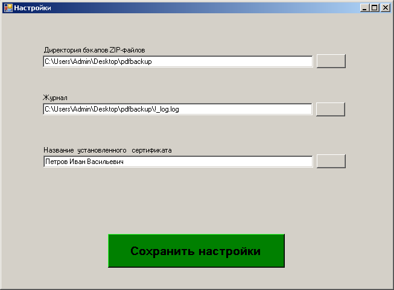

# PDF-sign-ZIP
Подписание файлов и ZIP
 
 Приложение Visual Studio 2017 C#, Window Forms, .NET Framework 4.5
  
  
 
 Краткое описание
 
 Для подписания требется установленная утилита сsptest.exe, входит в состав программы КриптоПро и позволяет выполнять операции через командную строку.

 Открыть "Сервис" -> "Настроки"

  

 "Название установленного сертификата" - Написать название своего сертификата установленого в данный момент по усолчанию
 
 Выбираем папку с PDF-файлами, которые требуется подписать. 
 
 Подписываются все PDF-файлы находящиеся в выбранной папке, подпись, в виде sig-файла создается для каждого PDF-файла,  также предусмотренно архивирование в ZIP.
 
 Создание ЭЦП можно выполнить как с архивированием так и отдельно, для этого предусмотрены разные кнопки.
